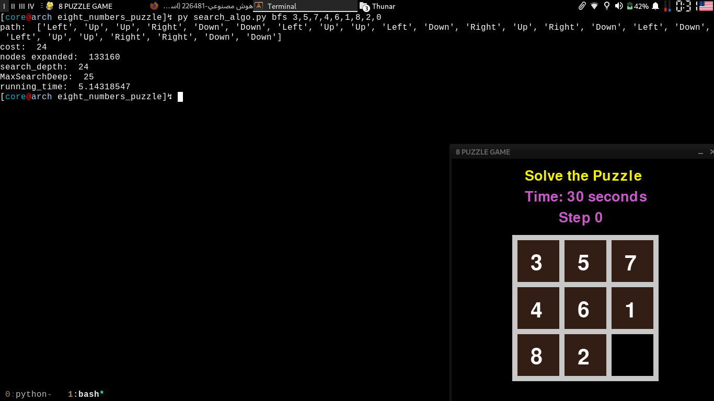

# eight-puzzle-solver

**eight puzzle gui with ai solver using bfs and dfs searching**

this project contains two python files, ```main.py``` is for gui eight puzzle app
and the ```search_algo.py``` is for search algorithms, by opening gui app you can
see the puzzle how created and then you can use the ```search_algo.py``` to show you
the path for solving the puzzle with two different algorithms **bfs** (breadth first search) and
**dfs** (depth first search) for doing that follo bellow commands.

first open the gui app for seeing the numbers of the puzzle, for doing that follow this command
```bash
core@arch:~$ python main.py
```
then use ```search_algo.py``` for giving you the path or the solution.

* for bfs search
```bash
core@arch:~$ python search_algo.py bfs 3,5,7,4,6,1,8,2,0
```


* for dfs search
```bash
core@arch:~$ python search_algo.py dfs 3,5,7,4,6,1,8,2,0
```

as you can see **dfs** take more time and a lot of cost for finding the path but **bfs** did it pretty quicker
with less costs.

you can follow the path for solving your puzzle but remember put gui numbers to ```search_algo.py``` for giving you
the path you want.
